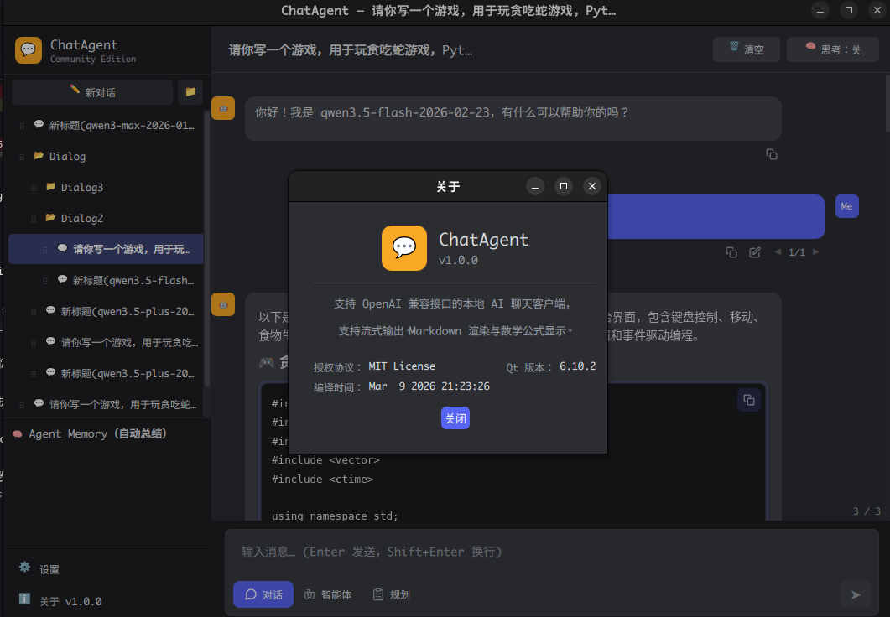

# ChatAgent



基于 Qt 6 + QML 的本地 AI Agent 客户端。支持 OpenAI 兼容 API（通义、DeepSeek 等）。

## 特点

- **三模式**：Chat（纯对话）/ Agent（ReAct 工具调用）/ Planning（规划拆解）
- **九大工具**：文件、Shell、网页搜索、键盘、OCR、窗口、剪贴板、等待、图像匹配
- **记忆**：短期滚动窗口 + 长期 SQLite 持久化，自动注入上下文
- **ReAct 编排**：意图识别 → 工具选择 → 执行 → 反思，多轮循环
- **原生桌面**：Qt 6，无 Electron，Discord 风格深色主题，跨平台
- **流式输出**：SSE 流式、Markdown+LaTeX 渲染、推理过程可视化
- **会话管理**：多会话、文件夹拖拽、消息编辑与重新生成

## 构建

```bash
mkdir build && cd build
cmake ..
make
./appAIChat
```

## 依赖

- Qt 6（Core, Gui, Quick, QuickControls2, Network, Sql, WebEngineQuick, WebChannel）
- 可选：`wmctrl` / `xdotool`（窗口/键盘）、`tesseract`（OCR）、`opencv-python`（图像匹配）
